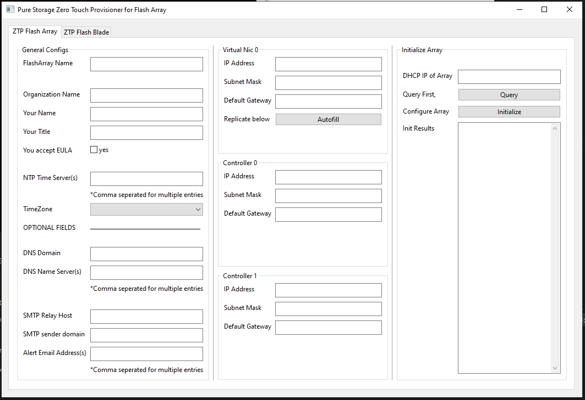

# Flash Array and Flash Blade Zero Touch Provisioners

Pure Storage Flash Array and Flash Blade Zero Touch Provisioner. This lighweight application allows engineers to remotely initialize a new FA or FB using this cross-platform console application.

## Getting Started

Download the application binary relevant to your desktop OS and execute it.  Fill out the fields and your off.

Also, for testing purposes I compiled the ztpDemo applications that call an Azure Function that is setup to respond to the rest calls for simulation.
The FA API endpoint for this testing is [https://pureapisim.azurewebsites.net/api/array-initial-config](https://pureapisim.azurewebsites.net/api/array-initial-config)

The FB API endpoint for this testing is [https://pureapisim.azurewebsites.net/api](https://pureapisim.azurewebsites.net/api) with the appropriate proceeding functions.  e.g. /login or /subnets, etc...  

The pureapisim project is here:  [https://gitlab.com/btshowers/pureapisim](https://gitlab.com/btshowers/pureapisim)

### Prerequisites

Windows 10 or higher, Linux, and MAC OS.

```
For Windows, download and launch ZTP.exe, fill out the form and go.
```

```
For Linux, (desktop GUI is required) download and launch appropriate ZTP binary, set it to executable "chmod +x", execute it and fill out the form.
```

```
For MacOS, download the appropriate ZTP binary, open terminal, set the binary to executable "chmod +x", execute it and fill out the form.
```

## Screen Shots

FlashArray



FlashBlade


## Built With

* [UI](https://github.com/andlabs/ui/) - The GUI framework used
* [Validator v9](https://gopkg.in/go-playground/validator.v9) - form validation
* [GOLang](https://golang.org/) - Core


## Authors

* **Brandon Showers* - - [btshowers](https://gitlab.com/btshowers)


## License

This project is licensed under the MIT License - see the [LICENSE.md](LICENSE.md) file for details

## Acknowledgments

* Thanks Simon Dodsley for the hackathon to get me to learn GOLang!

